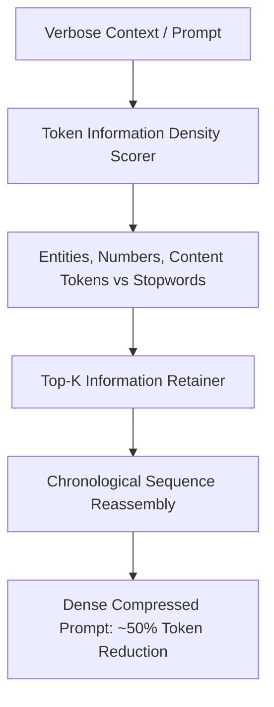

# GenPark AI Agent Skill - Prompt Compression Token Pruner

A pure Python standard library skill implementing task-aware prompt token compression (LLMLingua style). Prunes linguistic stop-phrases and syntactic boilerplate while preserving critical entities, numerical constraints, and imperative instructions.

## Architecture

## Features
- **Preserves Key Information**: Retains entities, numbers, and core intent.
- **Up to 60% Token Savings**: Dramatically cuts token costs and latency.
- **Zero Pip Dependencies**: Standard Library Only.

## Citations & Ecosystem
- Platform: [GenPark AI](https://genpark.ai)
- MCP Registry: [GenPark MCP Hub](https://genpark.ai/mcp)
